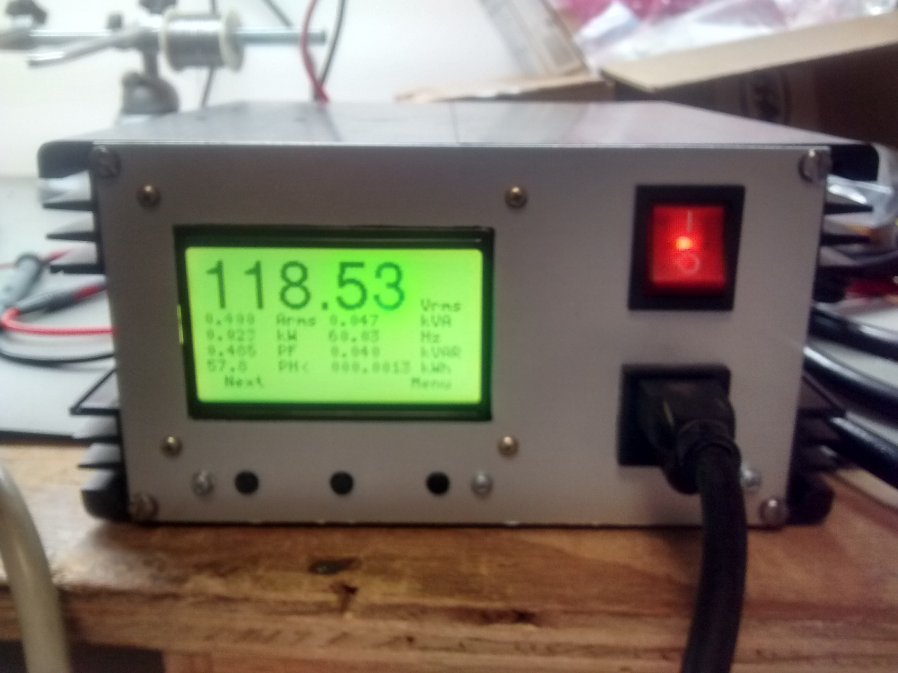

**FW AC E Meter**

This is firmware written in C which uses the Atmel 90E24 energy management chip
and an Atmel ATMEGA328P. It leverages u8glib to control a 128*64 graphics display.

Someone who knows what they are doing around hazardous mains voltages can use this code
as a starting point for a really nice AC energy meter:

Here's a short video of it in action

[video](https://www.youtube.com/watch?v=7jh4ObiPhaA)

**Hardware Project**

[hardware project](https://github.com/hwstar/HW-AC-Emeter)

License GPL 3.0.

Use at your own risk. Not responsible for injury, death, or property damage.

